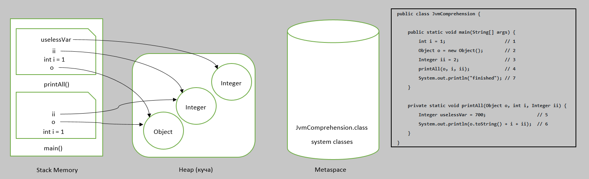

# Задача "Понимание JVM"

## Описание
Просмотрите код ниже и опишите (текстово или с картинками) каждую строку с точки зрения происходящего в JVM  

Не забудьте упомянуть про: 
- ClassLoader'ы, 
- области памяти (стэк (и его фреймы), хип, метаспейс)  
- сборщик мусора

## Решение
```java

// ClassLoader ищет класс "JVMComprehension", сохраняет его в MetaSpace

public class JvmComprehension {

    // в Stack Memory выделяется фрейм для метода "main"
    public static void main(String[] args) {

        //создается интовая переменная "i" = 1 в фрейме метода main в Stack Memory(пункт 1)
        int i = 1;                      // 1

        //ClassLoader ищет класс "Object", сохраняет его в MetaSpace
        //в куче (heap) создается объект Object;
        //в Stack Memory в фрейме метода "main" создается ссылка "о" на объект Object(пункт 2)
        Object o = new Object();        // 2

        //ClassLoader ищет класс "Integer", сохраняет его в MetaSpace
        //в куче (heap) создается объект Integer;
        //в Stack Memory в фрейме метода "main" создается ссылка "ii" на объект Integer(пункт 3)
        Integer ii = 2;                 // 3

        //в Stack Memory выделяется фрейм для метода printAll
        //в фрейме метода printAll создается ссылка "o" на объект Object в куче(heap)(объект создан во время операции 2)
        //в фрейме метода printAll создается интовая переменная "i" = 1
        //в фрейме метода printAll создается ссылка "ii" на объект Integer(объект создан во время операции 3)
        printAll(o, i, ii);             // 4

        //становится возможной сборка мусора, поскольку в программе уже не будут использоваться переменные "o", "i", "ii".

        //в куче (heap) создается объект String со значением "finished"
        System.out.println("finished"); // 7

        //после отработки метода println возможно удаление объекта "String" с текстом "finished"

    }

    private static void printAll(Object o, int i, Integer ii) {

        //в куче (heap) создается объект Integer;
        //в фрейме метода printAll создается сcылка "uselessVar" на объект Integer
        Integer uselessVar = 700;                   // 5

        //в Heap(куче) создается объект String, в который запишется результат "o.toString() + i + ii"

        System.out.println(o.toString() + i + ii);  // 6

        //после отработки метода println возможно удаление объекта "String", в который записан результат "o.toString() + i + ii"

    }
}

```


